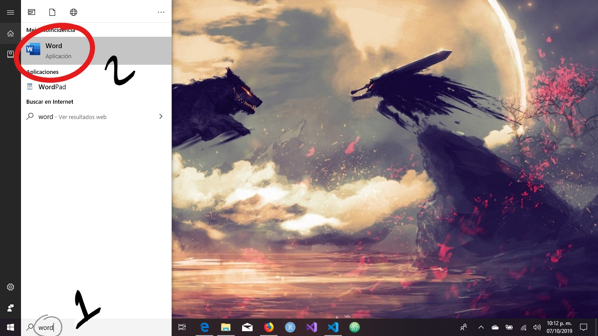
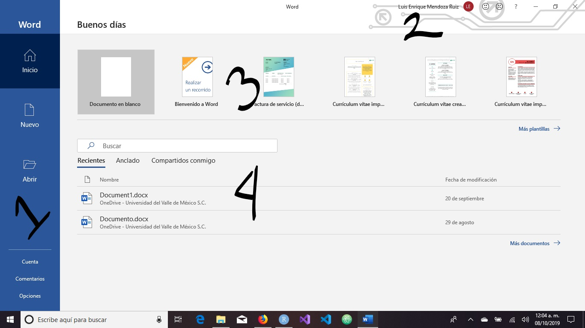

A continuación entraremos de lleno a las herramientas ofimáticas en general, y a __Microsoft Office__ y __LibreOffice__ en lo particular. Estas dos _suites_ ofimáticas son las más utilizadas, aunque la balanza se inclina sobremanera por la primera. La gran cuota de mercado que ostenta la solución de _Microsoft_ vuelve pertinente el aprender y dominar sus aplicaciones, sin embargo, no todos pueden permitirse el adquirir sus licencias. Ante esta dificultad, se vuelve necesario dominar la segunda opción: _LibreOffice_, la cual es libre y en términos prácticos, gratis. 

Abordaremos en primer lugar los procesadores de texto, tales como el casi omnipresente __Word__ y su contraparte libre, __Writer__. Enseguida cubriremos lo pertinente a las hojas de cálculo, siendo __Excel__ la oferta de _Microsoft_ y __Calc__ la libre. Posteriormente estudiaremos el _software_ para crear presentaciones: __PowerPoint__ e __Impress__. Para finalizar la unidad, veremos en forma un tanto superficial otras aplicaciones útiles para generar documentos que se salen del estándar de las _suites_ ofimáticas, tales como __Typora__ o __RMarkdown__ para el lenguaje de marcado _Markdown_ y __Lyx__ para _Latex_.

## Procesadores de texto

Entendemos los procesadores de texto como aplicaciones que nos permiten crear, editar y aplicar formato a documentos de texto. Se distancian de los editores de texto en que nos permiten realmente modificar aspectos visuales del texto en sí, como escribir en __negritas__, en _cursivas_, poner énfasis en ciertas frases o simplemente hacer más notorios los títulos. 

A pesar de su aparente sencillez, existen dos enfoques bien diferenciados en cuanto a cómo debería elaborarse un documento de texto. El más común es el conocido como __WYSIWYG__, _What You See Is What You Get_ ("lo que ves es lo que obtienes"), haciendo referencia a que lo que se observa en pantalla es lo que se obtendrá al imprimir el documento. Es un enfoque proveniente de las antiguas máquinas de escribir y como tal, también ha heredado ciertos vicios de aquellos tiempos, como el salto de línea, la tabulación, el doble espacio, etcétera. Parece el enfoque más lógico, pero también implica doble trabajo para el autor de documentos: generar el contenido (que es lo que verdaderamente importa) y aplicar el formato. Aplicaciones como _Word_, _Writer_ o _Dreamweaver_ siguen este enfoque.

El otro enfoque es el conocido como __WYSIWYM__, _What You See Is What You Mean_ ("lo que ves es lo que quieres decir"). Aquí el protagonismo lo tiene solamente el contenido del documento, por lo que el escritor debe enfocarse en él, dejando el formato para la aplicación. Aunque eso sí, el autor debe conocer la estructura y el orden semántico del _software_, a la vez que debe memorizar ciertos comandos o etiquetas. Además, el _software_ debe compilar el documento para dotarle un tipo de salida deseado. Las aplicaciones que representan muy bien este enfoque son algo escasas, sobresaliendo _Lyx_ (basado en _Latex_), aunque está más enfocado a la creación de documentos científicos. Algo similar en cuanto a enfoque, aunque no en cuanto a medios, es el lenguaje de marcado _Markdown_, el cual aprovecha algunas de las ventajas de _Latex_ para la generación de documentos técnicos, científicos y de ingeniería, además de proveer herramientas para creación de páginas web. Una aplicación que hace buen uso de _Markdown_ es __RStudio__, cuya implementación llamada _RMarkdown_ permite, además de lo anterior, la ejecución de código __R__, __Python__ y otros en el propio documento.

A continuación abordaremos las aplicaciones que pertenecen al primer enfoque. Posteriormente veremos unos trazos de aquellas que obedecen al segundo enfoque.

### Word

#### Abrir y guardar documentos

Lo primero que debe realizarse es precisamente ejecutar la aplicación. Cabe mencionar que estas instrucciones aplican a un sistema _Windows 10_ y _Office 2016_. Se consigue abrir _Word_ presionando la tecla _Windows_ (también conocida como _meta_) y escribiendo _word_. También puede ejecutarse presionando la combinación `Windows+S` para pedirle a _Cortana_ que ejecute la aplicación.

Al abrirse, lo primero que saldrá será la siguiente pantalla:

Esta es la pantalla de inicio y cuenta con cuatro secciones bien diferenciadas. La primera que salta a la vista es la barra azul de la izquierda. Ahí se encuentran las posibles acciones y opciones del programa, como `Inicio` (la pantalla actual), `Nuevo` (ofrece una buena cantidad de plantillas o documentos predefinidos) y `Abrir` (donde se muestran los documentos recientes, compartidos o presentes en alguna de las cuentas personales o de _OneDrive_ que hayamos registrado). En su parte inferior nos permite acceder a información de la cuenta (como el usuario o la licencia), el poder enviar comentarios sobre la aplicación a _Microsoft_ y opciones de la misma. Volveremos aquí más adelante. 

En la parte superior derecha, justo al lado de los botones de minimizar/maximizar, se encuentra el estado de la cuenta que se encuentra abierta, además de dos botones con forma de _emoji_ que sirven como atajo para los comentarios positivos y negativos de la sección pasada.

Justo debajo del saludo de "buenos días" se encuentra la sección de plantillas, donde _Word_ pone a disposición nuestra un pequeño resumen de las plantillas visibles en la pantalla de `Nuevo`. 

Para terminar, en la parte central inferior se encuentra un resumen de la pantalla `Abrir`.

Daremos clic a `Documento en blanco` y nos aparecerá la siguiente pantalla.

### Writer

### Markdown

#### Typora

#### RMarkdown

### Latex

#### Lyx

## Hojas de cálculo

### Excel

### Calc

## Presentaciones

### PowerPoint

### Impress

